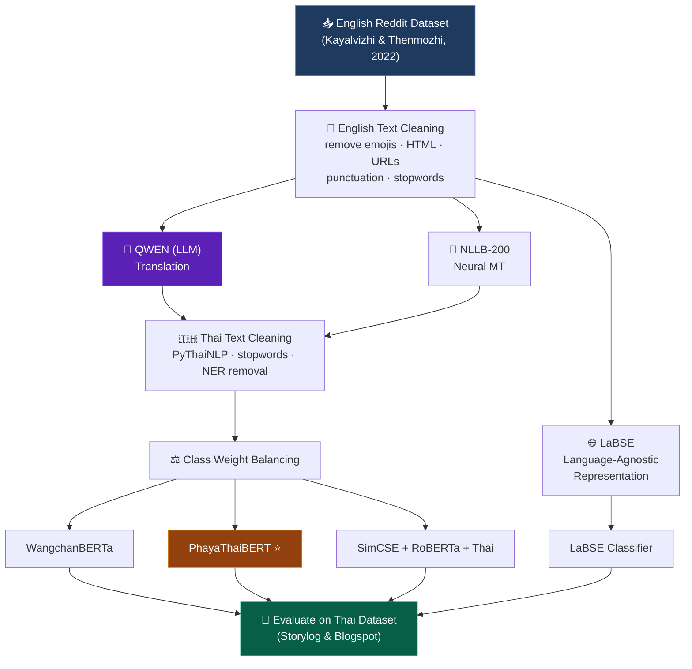

# 🧠 การจำแนกภาวะซึมเศร้าจากข้อความโซเชียลมีเดีย โดยใช้ชุดข้อมูลต่างภาษา และเทคนิคการเรียนรู้เชิงลึก

**Cross-lingual depression classification using English datasets to build Thai-language models**

 

 

*Computer Science, Faculty of Science — Kasetsart University*

---

## 📄 Abstract / บทคัดย่อ

> **🇬🇧 English**
>
> Due to the limited availability of Thai-language datasets for social-media text and depression detection, this research presents a method for **leveraging English-language datasets to develop a classification model** for detecting depression from Thai social-media text. The approach compares **English→Thai translation techniques** against **language-agnostic representation techniques**, and applies text classification using **PhayaThaiBERT**, **WangchanBERTa**, **SimCSE + RoBERTa + Thai**, and **LaBSE**. All models were evaluated on Thai-language datasets.
>
> **The best-performing pipeline combined Qwen (LLM) translation with PhayaThaiBERT classification.**

> **🇹🇭 ภาษาไทย**
>
> งานวิจัยนี้นำเสนอวิธีการใช้ชุดข้อมูลจากภาษาอังกฤษในการพัฒนาโมเดลจำแนกภาวะซึมเศร้าจากข้อความโซเชียลมีเดีย โดยใช้เทคนิคการแปลภาษาอังกฤษเป็นภาษาไทย เปรียบเทียบกับเทคนิคการแทนค่าแบบไม่ขึ้นกับภาษา ผลการทดลองพบว่า **เทคนิคการแปลภาษาด้วยโมเดล QWEN (LLM) ร่วมกับการจำแนกข้อความด้วย PhayaThaiBERT มีประสิทธิภาพดีที่สุด**

---

## 🔬 Methodology / วิธีดำเนินงานวิจัย

The study contrasts **two cross-lingual strategies**:

1. **Translation-based** — translate the English training data into Thai (via **Qwen** LLM or **NLLB-200** NMT), then fine-tune Thai transformers.
2. **Language-agnostic** — embed text directly with **LaBSE** without translation.

⭐ The winning combination was **Qwen translation → PhayaThaiBERT**.

---

## 🛠️ Models & Tools / เครื่องมือที่ใช้

| Component | Tool / Model |
|---|---|
| 🤖 Translation (LLM) | `Qwen/Qwen2.5-72B-Instruct` |
| 🔁 Translation (NMT) | `facebook/nllb-200-3.3B` |
| 🇹🇭 Thai NLP | `PyThaiNLP` |
| 🧩 Classifier 1 ⭐ | **PhayaThaiBERT** |
| 🧩 Classifier 2 | WangchanBERTa |
| 🧩 Classifier 3 | SimCSE + RoBERTa + Thai |
| 🧩 Classifier 4 | LaBSE |

---

## 📁 Dataset / ชุดข้อมูล

<table>
<tr>
<th align="left">🟦 Training Source (English)</th>
<th align="left">🟩 Test Source (Thai)</th>
</tr>
<tr>
<td valign="top">

**Reddit dataset**
Kayalvizhi & Thenmozhi (2022)

**Subreddits:**
`r/MentalHealth` · `r/depression`
`r/loneliness` · `r/stress` · `r/anxiety`

</td>
<td valign="top">

**Storylog & Blogspot**
Hämäläinen et al. (2021)

Thai-language social-media posts
used purely for evaluation

</td>
</tr>
</table>

**Classes:** `Depression` / `Non-Depression`

**Split:** `Train 75%` · `Validation 10%` · `Test 15%`

---

## 🏆 Award / รางวัล

### 🥇 Best Paper Award

| | |
|---|---|
| 🏅 **Award** | Best Paper Award |
| 🎓 **Conference** | NCCIT 2025 — The 21st National Conference on Computing and Information Technology |
| 🏛️ **Organizer** | The Association of Council of IT Deans (CITT), KMUTNB & Kanchanaburi Rajabhat University |
| 📅 **Date** | May 15–16, 2025 |
| 📍 **Venue** | Kanchanaburi, Thailand |

---

### Connect Us

 🤖 Thitima and team. 🤖

 

